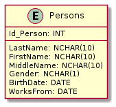
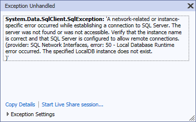
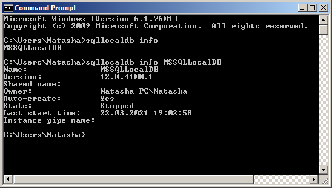
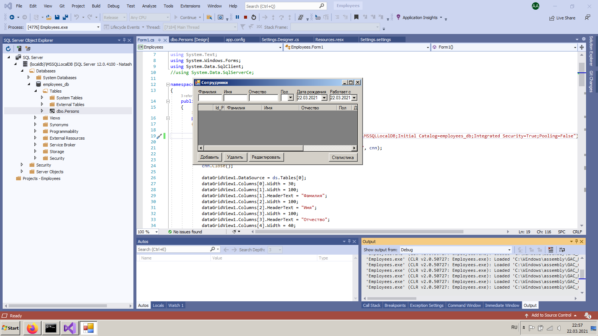
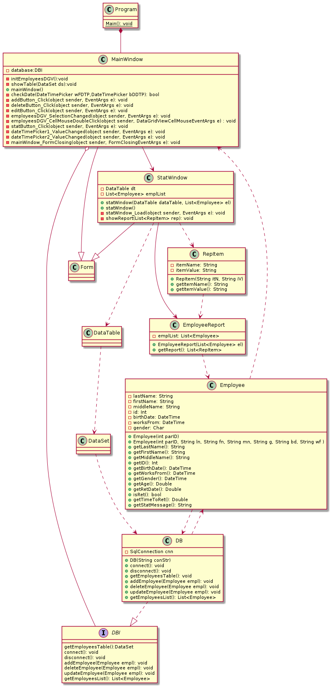
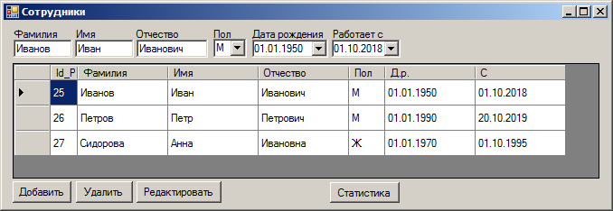
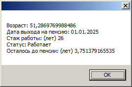
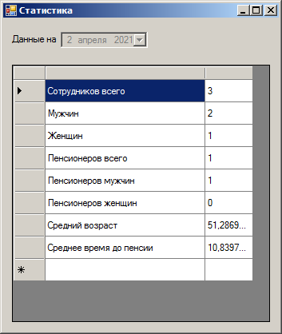

# ЛР1 "Рефакторинг"

## Условие задачи

Дана программа на C# с GUI для обработки данных (CRUD - create, read, update, delete) из БД, состоящей всего из одной таблицы (см. реляционную схему ниже), при помощи технологии ADO.NET. Особенность: все алгоритмы и взаимодействие с БД реализованы прямо в коде форм (см. [код формы основного окна](./OldCode/Form1.cs) и [код формы для вывода статистики](./OldCode/Form2.cs)).

Windows 7, Microsoft Visual Studio CE 2019.

План рефакторинга:

1. Настроить СУБД LocalDB, создать БД и запустить проект.
2. Переименовать формы, управляющие элементы и методы.
3. Реализовать паттерн ["Репозиторий"](https://metanit.com/sharp/articles/mvc/11.php) для взаимодействия с БД. 
4. Использовать [prepared statements](https://docs.microsoft.com/ru-ru/dotnet/api/system.data.sqlclient.sqlcommand.prepare?view=dotnet-plat-ext-5.0).

*Задание осложнялось тем, что это был, по сути дела, первый опыт написания программ на C# у автора.*

### Реляционная схема БД

## Рефакторинг

### Установка и настройка СУБД LocalDB

#### Особенности выбора версии

Для Windows 7 необходимо использовать версию LocalDB 2014 года. Более новые версии не поддерживаются. 

#### Проблемы, связанные с instance

При возникновении проблем при помощи команды `mssqllocaldb info` необходимо убедиться, что **instance** `MSSQLLocalDB` существует. Если это не так, ее нужно создать вручную при помощи `mssqllocaldb`. Если она присутствует, но проблема не исчезает, то **instance** следует удалить вручную и создать повторно. 

#### Предупреждение "A remote operation taking longer than expected" при попытке запуска приложения

Решение представлено [здесь](https://stackoverflow.com/questions/12252969/visual-studio-2012-a-remote-operation-is-taking-longer-than-expected).    

### Создание БД

БД была создана при помощи следующего сценария на языке SQL:

    CREATE DATABASE [employees_db] COLLATE Cyrillic_General_CI_AS;
    CREATE TABLE [dbo].[Persons] (
           [Id_Person]  INT        IDENTITY (1, 1) NOT NULL,
        [Lastname]   NCHAR (20) NULL,
        [Firstname]  NCHAR (20) NULL,
        [Middlename] NCHAR (20) NULL,
        [Gender]     NCHAR (1)  NULL,
        [BirthDate]  DATE       NULL,
        [WorksFrom]  DATE       NULL,
        PRIMARY KEY CLUSTERED ([Id_Person] ASC)
    );

В отличие от реляционной схемы в данном сценарии установлена длина фамилии, имени и отчества в 20 символов, а не в 10, как в оригинале. 

#### Новая строка подключения к БД

    "Data Source=(localDB)\\MSSQLLocalDB;Initial Catalog=employees_db;Integrated Security=True;Pooling=False"

### Запуск проекта

#### Ошибка распознавания дат

При запуске оригинального приложения периодически возникала следующая ошибка:

    Conversion failed when converting date and/or time from character string

Выяснилось, что она возникает из-за того, что при распознавании дат в формате `XX.YY.ZZZZ` XX распознавался как номер месяца, поэтому даты типа `20.01.2020` вызывали появление этой ошибки. Проблема была, как ни странно, решена после перехода на **prepared statements**. 

#### Результат

В результате первоначальный проект удалось запустить

### Переименование классов и методов

Использовать комбинацию клавиш **[CTRL]+[R]**.

## Результаты рефакторинга

### Диаграмма классов

### Код

См. каталог `Employees`

[Класс MainWindow](./Employees/Form1.cs)

[Класс StatWindow](./Employees/Form2.cs)

### Снимки экрана

#### Главное окно

#### Информация о сотруднике

#### Окно статистики

